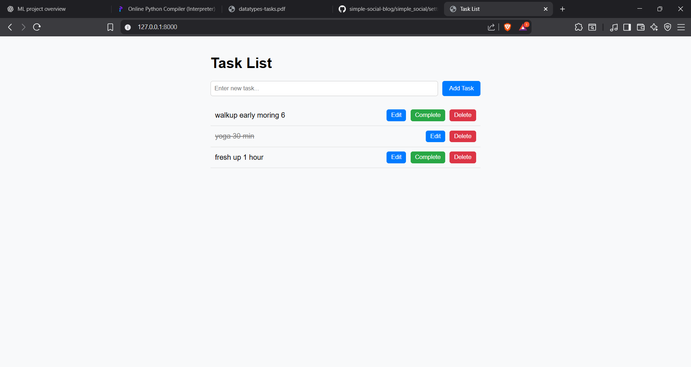
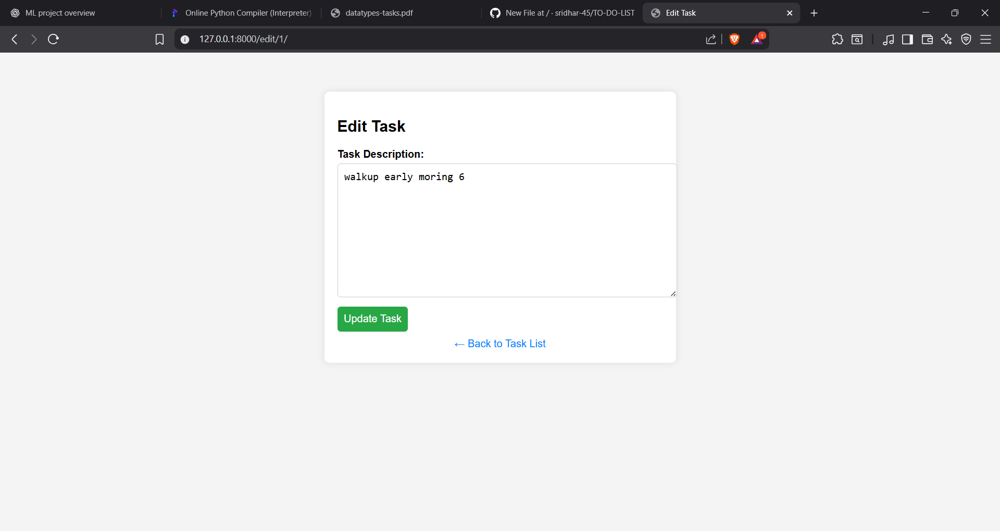
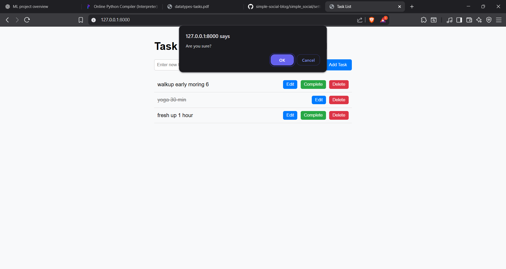
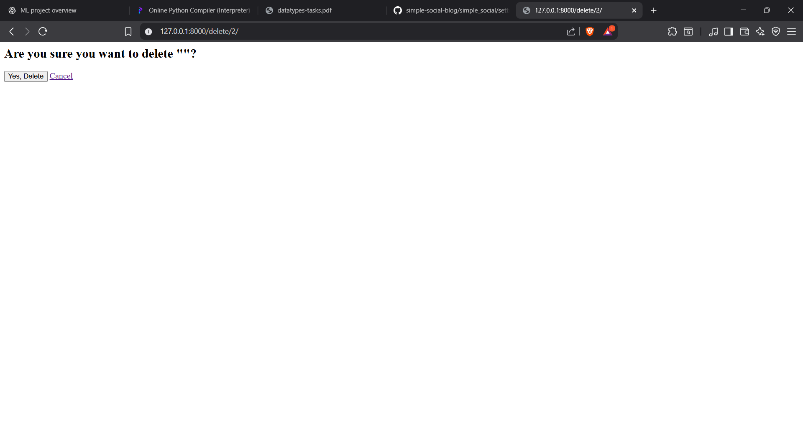

# 📝 Django To-Do List App

A simple yet powerful **To-Do List web application** built with **Django** and **MySQL**, offering full **CRUD (Create, Read, Update, Delete)** functionalities. It features a **responsive and user-friendly interface** styled using **Bootstrap**, and supports **task filtering** with session-based task management.

---

## 🚀 Features

- ✅ Add new tasks
- 📝 Edit existing tasks
- ❌ Delete completed/unwanted tasks
- 📌 Filter tasks (completed/pending)
- 💾 Persistent storage with MySQL
- 🎨 Responsive UI using html, css
- 🔐 The tasks stoes in mysql in localhost

---

## 🖼️ Screenshots

Below are some screenshots of the project from the `to_do_list_screenshots` folder:

### 📋 Home Page



### 📝 Edit Task



### ✅ Delete Tasks




### ✅ confirm to delete  Tasks



---

### ✅ return to Home


## 🧰 Tech Stack

| Layer         | Technology               |
|---------------|--------------------------|
| Backend       | Django (Python)          |
| Database      | MySQL                    |
| Frontend      | HTML, CSS, JavaScript    |
| Styling       | Bootstrap 5              |
| Deployment    | GitHub (future: Render)  |

---

## 💡 How to Run Locally

1. **Clone this repo**  
   ```bash
   git clone https://github.com/sridhar-45/TO-DO-LIST.git
   cd TO-DO-LIST
